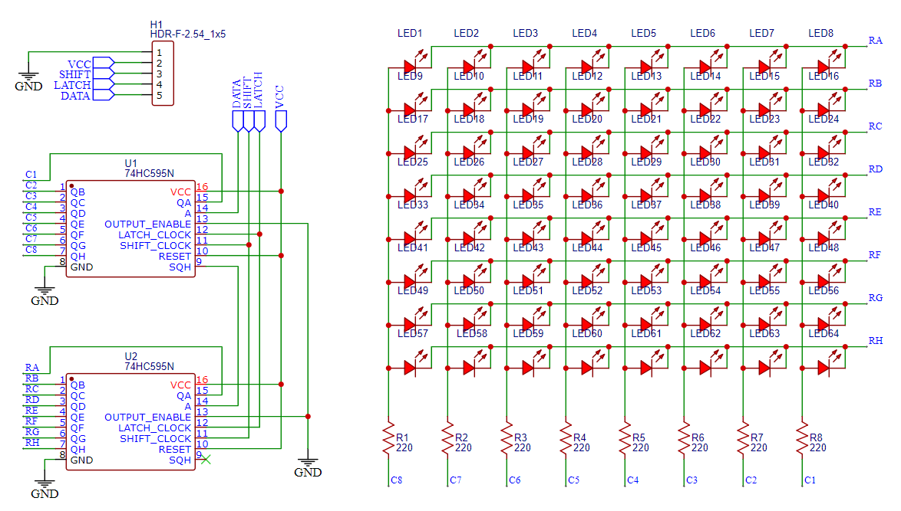

RP2040 8x8 LED Matrix
========================

This is a MicroPython program driving an 8x8 LED matrix using two 74HC595.

See [my blog post](https://medium.com/nerd-for-tech/build-a-raspberry-pi-pico-powered-8x8-led-matrix-from-scratch-8caf9ef04116) for project details.

## Schematic

